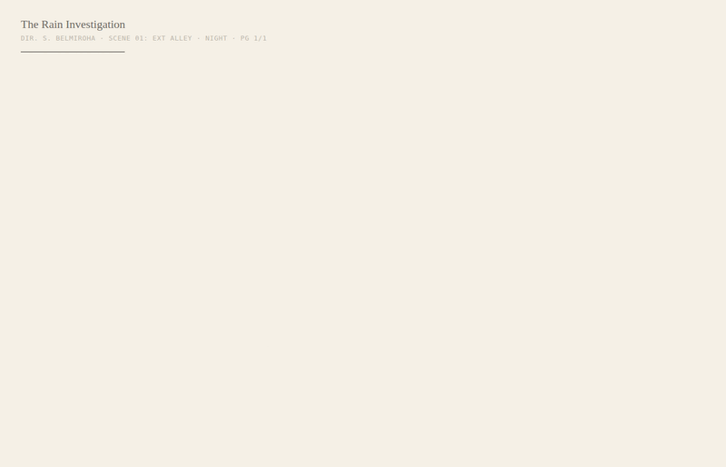
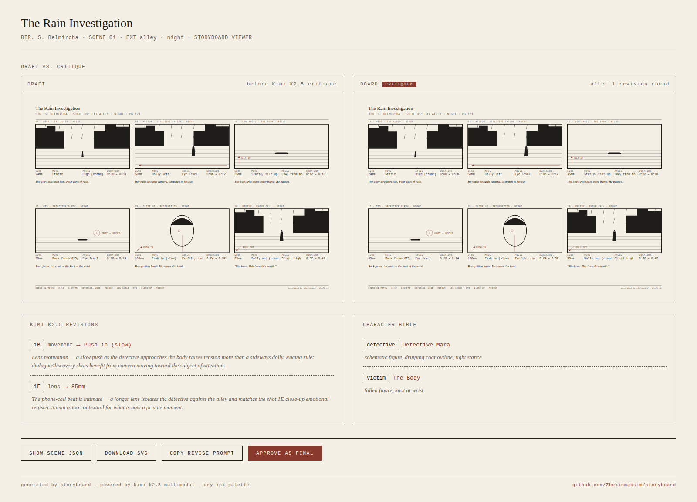
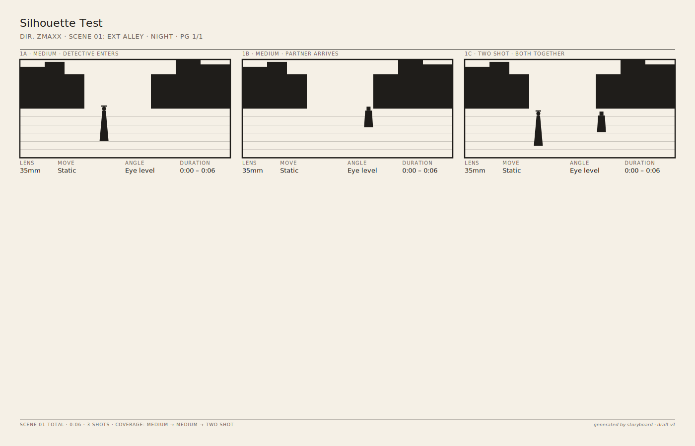
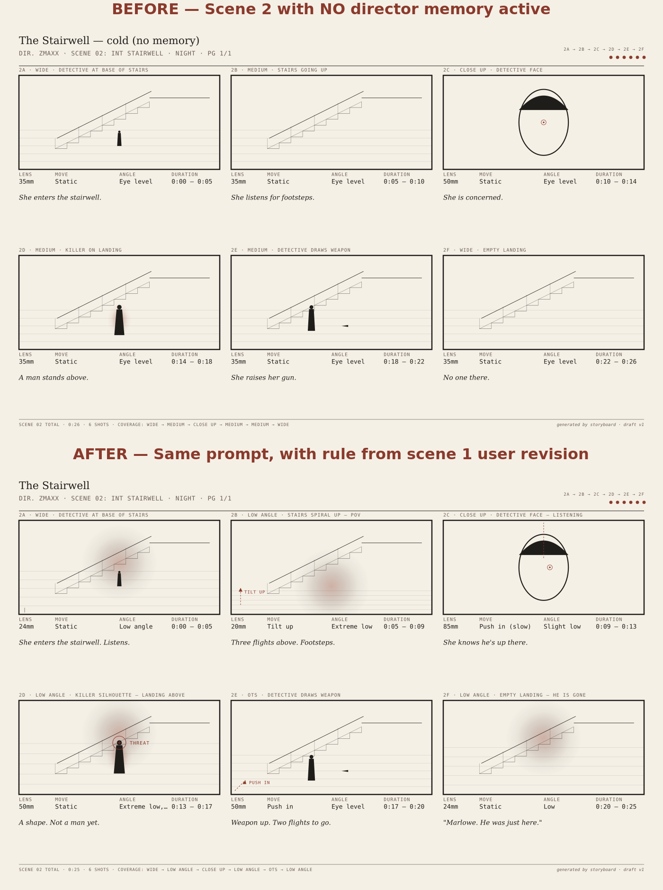

# storyboard

> Hermes Agent skill: prose → editable Dry Ink film storyboards that
> **draw themselves live in your browser**, with a Kimi K2.5 multimodal
> review pass that flags film-grammar issues before approval.

[](https://github.com/Zhekinmaksim/storyboard/actions)
[](LICENSE)
[](https://hermes-agent.nousresearch.com)
[](https://openrouter.ai/moonshotai/kimi-k2.5)

`storyboard` turns a paragraph of prose into a real film storyboard —
six schematic frames in the **Dry Ink** palette, with camera/lens/move/
duration metadata, eye-line annotations, focus rings, and italic
captions. Frames **draw themselves stroke-by-stroke** when you open the
SVG, so the board looks hand-sketched live. Then **Kimi K2.5 reviews
the rendered board** against five film-grammar rules (180-degree line,
eye-line continuity, coverage gaps, lens motivation, pacing) and
proposes targeted revisions — with the flagged frames pulsing on
canvas where the change applies. You approve or edit before the board
is finalised.

No diffusion. No AI slop. Just structure, drawn live.


*The board self-draws stroke-by-stroke when you open it. ~9 seconds end-to-end.*


*The viewer: side-by-side draft vs. critiqued board, Kimi's revisions
panel with film-grammar reasoning, character bible, approval gate.*


*Character continuity is visual. Detective on the left
(`long coat, narrow shoulders, fedora hat`) vs. Partner on the right
(`broad shoulders, short jacket, square jaw`) — same render code,
different bible silhouettes.*

---

## Why this is Hermes-native

This skill is built for the way Hermes Agent actually works, not
bolted on:

- **Persistent character bible** across runs — `character_bible.json`
  in `$STORYBOARD_OUTPUT_DIR` survives between sessions; subsequent
  scenes inherit the silhouette of any role mentioned by name. The
  silhouette **visibly affects rendering** — the detective with `long
  coat, narrow shoulders, fedora` looks tall and slim with a hat in
  every shot they appear, in every scene.
- **Director memory** — when you revise a frame with a free-text note,
  Kimi extracts a **generalised** style rule and saves it. The next
  scene applies the rule automatically without you re-stating it. This
  is the same self-improving pattern Hermes Painter uses for paint
  style — see [Learning loop](#learning-loop) below for proof.
- **Skill trigger phrases** baked into `SKILL.md` for natural chat
  invocation: *draft a storyboard*, *block out this scene*,
  *plan the camera for*, *сделай раскадровку*.
- **Three-role Kimi loop** — parse, env enrich, multimodal critique —
  not a single LLM call dressed up.
- **Human approval gate** between auto-critique and finalise; the
  pipeline halts after one revision round and waits for the user.
- **Targeted revisions, not full regeneration** — `storyboard revise
  --frame 1F --note "..."` re-renders one frame and leaves the
  others bit-identical. This is the single most-asked-for thing
  in agentic creative tools.
- **Reusable, editable outputs + production packet** — every frame is
  a `<g>` group with `data-shot-label`, every artefact (Scene,
  Revisions, Bible, Memory) is plain JSON. No black-box images. The
  approved scene auto-exports a [production packet](#production-packet)
  the production team can hand to a DP, 1st AC, or script supervisor.

---

## Learning loop

This is the difference between *"an AI that draws when asked"* and
*"an AI that learns how this director directs."*

You revise a single frame in scene 1 with a free-text note:

```bash
storyboard revise scene.v2.json --frame 1F \
  --note "more Hitchcock — low angle, harder shadow, killer as silhouette"
```

Kimi K2.5 reads the note, extracts a **generalised** style rule, and
persists it to `director_memory.json`:

```json
{
  "preference": "For suspense, danger, and reveal moments, prefer
                 low-angle framing with stronger cast shadows. When
                 showing a threat or unseen antagonist, render them as
                 a partial silhouette rather than a fully-lit figure.",
  "applies_to": ["suspense", "reveal", "danger", "threat",
                 "killer entrance", "stairwell", "pursuit"]
}
```

The next time you draft a scene whose prose mentions any of these
contexts, the rule is injected into the parse system prompt — and
the new scene reflects the rule **without you asking again**.


*Same prompt, two scenes. Top: scene 2 with no memory active —
eye-level angles, plain killer figure. Bottom: scene 2 after the
scene-1 revision rule was learned — four low-angle shots, killer as
silhouette with a "THREAT" focus marker, torchlight cones on suspense
beats, and Detective Mara consistent with her bible silhouette.*

Inspect what Hermes has learned at any time:

```bash
storyboard memory --show     # list all learned rules
storyboard memory --clear    # erase memory
```

The full bundle behind the image above — both scene JSONs, both
renders, the memory file, the bible — is checked in at
[`examples/output/learning-demo/`](examples/output/learning-demo/).
A judge can inspect every artefact without running a single command.

---

## Production packet

A storyboard is the start of pre-production, not the end. Approved
scenes auto-export the ancillary documents the production team
actually needs:

```
~/storyboard-output/packet/
├── shotlist.csv       # spreadsheet — type, lens, move, angle, duration, location
├── camera_notes.md    # DP/1st AC handoff with per-shot intent + eye-line + axis
├── dialogue.md        # quoted speech extracted from captions, by shot label
└── continuity.md      # script-supervisor sheet — who's in each shot, pose, state
```

Or trigger packet export manually for any approved scene:

```bash
storyboard packet ~/storyboard-output/scene.v2.json
```

This is what positions Storyboard as the **upstream pre-production
layer** for any downstream creative pipeline — animation, audio drama,
live-action shoot, or video generation. See an example packet at
[`examples/output/noir-run/packet/`](examples/output/noir-run/packet/).

---

## What it is

A pre-production tool. Schematic by convention, not by limitation. The
output looks like industry storyboards because that's what storyboards
look like — cream paper, ink strokes, mono metadata, italic captions.
Every frame is **editable SVG** — not a black-box image. Open the file
in any browser; it animates itself.

## What it isn't

- Not photorealistic concept art. Use a diffusion skill for that.
- Not a replacement for a human storyboard artist on a real production.
- Not a video generator. The animation is in your head, between the
  frames. (That's the point of storyboards.)

## Why Kimi K2.5

K2.5 is multimodal-native and produces strict JSON reliably. It fills
**three** roles in this skill:

1. **Parser** — prose → structured Scene JSON with shots, lenses,
   movements, eye-lines.
2. **Environment renderer** — for scenes that don't fit templates
   (sci-fi corridors, swamps, surgical theatres), Kimi generates
   per-shot SVG fragments, validated against a strict Dry Ink
   whitelist before render. This is what makes the skill work on
   *any* prose, not just noir.
3. **Critic** — sends the rendered PNG back, applies five film-grammar
   rules, returns a structured list of revisions. The critic is on a
   leash — it can only revise a finite whitelist of fields and cannot
   invent shot labels. See [`references/critique-criteria.md`](references/critique-criteria.md).

## Scope — what kinds of prose work

Storyboard accepts **any prose between 5 and 2000 characters**, in any
language Kimi K2.5 supports (English, Russian, Mandarin, Arabic,
Spanish, French, German, Japanese, etc.). The pipeline is genre-agnostic
because film grammar is genre-agnostic.

**Works well on:**
- Concrete scenes with characters and actions —
  *"A detective enters a rain-soaked alley…"*
- Dialogue-driven moments —
  *"Two siblings argue across a kitchen table at noon…"*
- Genre fiction (noir, sci-fi, historical, fantasy, cyberpunk) —
  the parser extracts shot grammar regardless of setting.
- Documentary / nature observation —
  *"A honeybee approaches a sunflower. She lands on a petal…"*
- Non-English prose — Kimi K2.5 is multilingual; figures, environments,
  and shot metadata render the same way.

**Where rendering quality varies:**
- **Non-template environments** (spaceship corridors, swamps,
  operating theatres) trigger the **enrich** stage — Kimi K2.5
  generates schematic SVG fragments for those shots, validated against
  the Dry Ink whitelist. Validation occasionally fails; in that case
  the shot falls back to a generic interior or exterior template. This
  is by design (better generic than broken) but means that visually
  unusual scenes may render with template environments rather than
  bespoke ones.
- **Abstract or stream-of-consciousness texts** —
  *"Love is the movement of time toward hope"* — get parsed into shots,
  but without concrete people, places, or actions the result will be
  thin: figures on empty backgrounds, repeated framings.
- **Very short fragments** under ~30 characters — Kimi will still
  produce 6 shots, but they tend to repeat the same beat.

**Strict limits:**
- 5..2000 character range
- No HTML tags or control characters (basic injection guard)
- One scene = one page = six shots in v0.1; multi-page boards in v0.2

If your prose feels under-served by the result, the simplest fix is to
add a sentence of physical detail — *who* is in the shot, *where* they
are, *what* they're doing. The structural parser leans on those three.

## Hybrid loop, not auto-loop

The skill drafts a board, runs **one** auto-critique round, applies the
revisions, and then **stops for you**. You review the live viewer with
flagged frames pulsed on canvas, approve, or request a targeted edit:

```bash
storyboard revise scene.v2.json --frame 1F --note "low angle, harder shadow"
```

Only frame 1F re-renders. Other frames are untouched. This is the
director-in-the-loop workflow that makes the skill a tool instead of a
black box.

## Character continuity

The skill keeps a tiny `character_bible.json` across runs. When you
draft scene 2 referencing the same `detective` role used in scene 1,
the bible's silhouette is injected into the parse prompt so the
character persists. See
[`references/character-bible-format.md`](references/character-bible-format.md).

---

## For judges — 30-second eval

If you don't want to set up an API key, **everything you need to
evaluate this project is committed to the repo**:

| Look at | Why |
|---------|-----|
| [`examples/pocs/live-drawing.gif`](examples/pocs/live-drawing.gif) | The wow: a board self-drawing in 9 seconds. |
| [`examples/output/noir-run/`](examples/output/noir-run/) | Complete output of one full pipeline run. Open `viewer-screenshot.png` for the live viewer, or `board.animated.svg` in Firefox to watch it draw itself. |
| [`examples/output/noir-run/packet/`](examples/output/noir-run/packet/) | Production packet — shotlist.csv, camera_notes.md, dialogue.md, continuity.md. The pre-production handoff a real DP gets. |
| [`examples/output/learning-demo/cold-vs-directed.png`](examples/output/learning-demo/cold-vs-directed.png) | **Proof that memory changes future scenes.** Same prompt, two scenes — top has no memory active, bottom inherits the Hitchcock rule from a scene-1 user revision. |
| [`examples/output/learning-demo/director_memory.json`](examples/output/learning-demo/director_memory.json) | The actual rule extracted by Kimi K2.5 from a free-text revision note. |

If you do have an API key:

```bash
export OPENROUTER_API_KEY=sk-or-...
make install
make judge-demo            # full live-stream demo, requires Firefox
# or
make judge-demo-offline    # render the shipped example, no API call
```

---

## Install

```bash
# As a Hermes skill — drop into your skills directory
git clone https://github.com/Zhekinmaksim/storyboard ~/.hermes/skills/creative/storyboard

# As a standalone CLI
pip install -e .
```

You need:

- Python ≥ 3.10
- `OPENROUTER_API_KEY` from https://openrouter.ai
- `librsvg2-bin` (Ubuntu/Debian) **or** `librsvg` (macOS, via brew)
  **or** `cairosvg` (`pip install cairosvg`) — for SVG → PNG conversion
  during the critique step.
- A **modern browser** for live viewing — Firefox or Safari recommended
  (best SMIL animation support). Chromium-based browsers work but
  Chrome's SMIL support is officially deprecated.

```bash
export OPENROUTER_API_KEY=sk-or-...
```

## Usage

### Hermes / chat

```
draft a storyboard for: A detective enters a rain-soaked alley at night,
finds a body, calls his partner. Three murders this month, same knot.
```

The skill triggers on phrases like *draft a storyboard*, *block out this
scene*, *plan the camera for*, *сделай раскадровку*.

### CLI — live drawing mode (the WOW)

```bash
# Open the live viewer at http://localhost:7777 BEFORE running this:
storyboard full --stream "A detective enters a rain-soaked alley at night..."
```

Frames stream into the viewer one at a time, each animating its own
strokes. Kimi's critique appears beneath the board with revisions
pulsing on the corresponding frames.

### CLI — standalone mode

```bash
# End-to-end with approval gate (no live viewer, animated SVG written to disk)
storyboard full "A detective enters a rain-soaked alley..."
# Open ~/storyboard-output/board.animated.svg in Firefox — it self-draws.

# Granular subcommands
storyboard parse "A detective enters..." -o scene.json
storyboard render scene.json -o board.svg
storyboard critique scene.json board.png -o revisions.json
storyboard iterate scene.json revisions.json -o scene.v2.json

# Targeted user-driven revision
storyboard revise scene.v2.json --frame 1F --note "Hitchcock — low angle, harder shadow"

# Open the viewer for the latest run
storyboard view

# Inspect or edit the character bible
storyboard bible --show
storyboard bible --set-silhouette "detective=narrow shoulders, wet coat"
```

Outputs land in `$STORYBOARD_OUTPUT_DIR` (default `~/storyboard-output/`):

```
~/storyboard-output/
├── scene.json              # parsed Scene from prose
├── draft.svg / .png        # static render before critique (PNG used for Kimi vision)
├── draft.animated.svg      # self-drawing version for browser viewing
├── revisions/
│   └── round_1.json        # Kimi's revision suggestions
├── scene.v2.json           # scene after revisions applied
├── board.svg / .png        # final rendered board (static)
├── board.animated.svg      # final self-drawing board
├── character_bible.json    # persistent role + silhouette memory
└── viewer.html             # side-by-side viewer with approval buttons
```

A complete real run is checked in for inspection without running the
pipeline yourself: see [`examples/output/noir-run/`](examples/output/noir-run/).
It contains the input prose, the parsed Scene, both static and
animated SVG renders, the PNG, Kimi's critique JSON, the post-critique
v2 scene, the character bible, and a screenshot of the live viewer.

---

## How the pipeline works

```
prose
  ↓
parse.py            ← Kimi K2.5 (text-only)
  ↓ Scene JSON
character_bible     ← injected into next parse
  ↓
enrich.py           ← Kimi K2.5 (per-shot env SVG, only if templates miss)
  ↓ Scene + custom_svg
render.py           ← pure Python, two modes:
  ├─ static SVG     → PNG export → critique
  └─ animated SVG   → SMIL stroke-draw → live viewer
  ↓
png_export.py       ← rsvg-convert / cairosvg
  ↓ PNG
critique.py         ← Kimi K2.5 (multimodal vision)
  ↓ revisions
iterate.py          ← deterministic field updates
  ↓ Scene v2
render.py           ← (animated) → live viewer pulses flagged frames
  ↓ SVG v2
viewer.html         ← side-by-side, approval gate ────► YOU
                                                        │
                          targeted user note  ──────────┘
```

One auto-critique round, then the loop hands off. No silent multi-round
auto-iteration in v0.1.

### Live streaming pipeline (`--stream`)

```
storyboard full --stream "..."
  │
  ├─► HTTP server boots on :7777
  │   └─ EventSource at /events
  │
  ├─► Firefox connects to viewer
  │
  └─► Pipeline pushes:
       │ event: scene  → header + footer skeleton
       │ event: shot   → per-frame <g> with SMIL animations  ×6
       │ event: critique_start
       │ event: revision → frame pulses on canvas             ×N
       │ event: done
```

Each shot SVG carries its own SMIL `begin` offsets, so animations play
the moment the element lands in the DOM. No client-side animation
library. No WebSocket. No async runtime.

---

## Hallucination control

Storyboard treats Kimi as a **proposer**, not an authority. Every Kimi
output passes through a deterministic validator before it can affect a
rendered board, an exported file, or a persisted memory rule. The
overall stance:

> Kimi proposes. Storyboard verifies. Hermes remembers only what is
> safe to reuse.

What that means concretely, layer by layer:

**Scene parsing.** The Scene JSON schema uses Python enums for shot
type, lens, movement, angle, eye-line direction, and eye-line axis
status. Anything Kimi returns that doesn't match an enum raises
`ValueError` and triggers a single retry with the validation error fed
back. Two failures → fall back to a stub scene the user can edit by
hand. Malformed JSON is treated the same way.

**Critique patches, not rewrites.** Kimi's vision review can only emit
revisions over a whitelist of seven fields:
`angle, lens, movement, duration, caption, eye_line.direction,
eye_line.axis_status`. Anything outside that whitelist is dropped with
a stderr warning. Shot labels are cross-checked against the current
Scene — hallucinated `1G` revisions never reach the renderer. Each
revision can carry an optional `old_value`; if it doesn't match the
current scene field, the patch is rejected (defense against critic
operating on a stale snapshot).

**SVG safety + grammar whitelist.** Kimi-generated environment
fragments pass through a tag whitelist
(`line, rect, circle, ellipse, path, polygon, g`) and a color whitelist
(only Dry Ink palette tokens). Banned by construction:
`script`, `foreignObject`, `image`, `href`, external filter refs,
external animation refs. Failed validation falls back to a deterministic
template — the rendered board never embeds raw model output.

**Director memory cannot add plot facts.** The memory extraction prompt
explicitly forbids storing character names, props, dialogue, or story
events as style memory. Only framing, lighting, pacing, composition,
and emphasis preferences. After Kimi returns a rule, a post-validator
checks the preference text and tags against a deny-list of plot terms
(named props like *knife* / *lotus*, named characters, named locations,
named events). Rules that leak plot facts are rejected; the system
falls back to a raw-note rule scoped to the originating scene only.

**Source-tagged inferences.** Atmospheric features inferred from prose
keywords (rain, neon sign, fire escape, puddle, body, phone, weapon)
are tracked in `environment.inferred_sources`, mapping each flag to
the keyword that triggered it (e.g.
`{"has_neon": "prose:alley", "has_rain": "prose:downpour"}`). This
makes the lineage explicit: every visual element either came from the
prompt, came from inference (and we say from which keyword), or came
from a memory rule (and we say which one).

**No hallucination can ship unless it passes** schema, source, patch,
and render validation. We don't claim Kimi never hallucinates — we claim
hallucinations don't reach the user's downloaded artifact.

---

## Limits, stated plainly

- Kimi may return malformed JSON for parse. We retry once with the
  validation error fed back. Two failures → fall back to a stub Scene
  the user can edit by hand.
- Kimi-generated environment SVG is validated against tag/color/stroke
  whitelists. Failed validations drop with a stderr warning and use
  template fallback — never a broken render.
- The critique can hallucinate. Every revision's `shot_label` is
  cross-checked against the Scene; invalid labels drop with a stderr
  warning. The whitelist of revisable fields is finite.
- The renderer does not yet vary figures by silhouette tag — the bible
  influences parse, not render. Planned for v0.2.
- One page, six shots, in v0.1. Multi-page boards are v0.2.
- SMIL is officially deprecated by Chrome (still works, never removed).
  Demo recording uses Firefox for guaranteed playback.

---

## Hackathon submission

Built for the **Nous Research Hermes Agent Creative Hackathon**, May 3
2026 deadline. Targets the **Kimi Track** (Kimi K2.5 is load-bearing
in three roles: parse prose → Scene JSON, critique rendered PNG → patch
list, extract director memory → reusable rule) and the **Main Track**
(creative software, agentic loop, character memory, live drawing,
director-revision workflow).

The hackathon runs in the **Nous Research Discord**
(`discord.gg/nousresearch`) — submission is a post in the dedicated
hackathon channel with a demo video and a GitHub repo link. Not
on lablab.ai, not on Devpost.

The 90-second demo video script and asset list are in
[`demo/script.md`](demo/script.md).

## License

MIT. See [LICENSE](LICENSE). Dry Ink palette is public-domain prior art
(industry storyboards have used cream + warm ink for a century);
Newsreader and Geist Mono are open-licensed.

## Credits

- [Hermes Agent](https://hermes-agent.nousresearch.com) by Nous Research
- [Kimi K2.5](https://openrouter.ai/moonshotai/kimi-k2.5) by Moonshot AI
- Newsreader by Production Type, Geist Mono by Vercel

Built by [Zmaxx](https://github.com/Zhekinmaksim) — companion to
[VEIL](https://github.com/Zhekinmaksim/hermes-veil) and
[tempo-meter](https://github.com/Zhekinmaksim/tempo-meter) in the
Hermes skills lineup.
